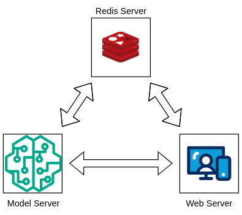
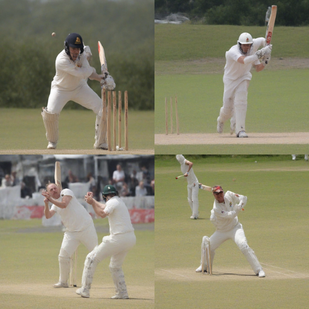

# Microservice for deploying Stable (Video) Diffusion

# Overview
In this repository, we deploy Stable (+Video) Diffusion (SDXL and SVD) for training and inference in a decoupled micro-service architecture using FastAPI. 

# Working

The progress of the training is logged using Redis and can be tracked via an endpoint.   
For  inference, we can either generate a picture (SDXL) or a video (SVD). Artifacts are uploaded to S3, and generated media can be downloaded via its pre-signed URL.
While either a training or an inference job is running, another job cannot be scheduled. For speeding up the inference, [DeepCache](https://github.com/horseee/DeepCache) is used which speeds up by more than 2x.

  

# Endpoints

### `/train`
This trains the model using Dreambooth, generates a safetensors file, and uploads it to S3.

The query parameters are
- prompt: The prompt for the model
- model_id: The name assigned to the model. This will be used for generating images
- max_steps: The maximum number of steps the model is trained on

It also has a body parameter for the files that are used to train the model.

(Note that the train steps have been kept high so that the training progress can be shown in the demo video; it needs to be tuned for better results)

### `/result`

This shows the progress of the training job. It takes in the `task_id` parameter which can be obtained after a training job has been submitted.

### `/generate/sdxl`

This generates either images or video depending on the `allow_motion` parameter. It does not use the weights generated by training

The query parameters are
- prompt: The prompt for the model
- allow_motion: Whether to generate video (set it to 'True') or just images. Note that  images are always generated since the generated image is used to generate a video

### `/generate/lora`

Similar to  `/generate/sdxl` but has an additional `model_id` parameter since it downloads the corresponding weights from S3 to generate images.

### `/images`
This shows us the status of the generation job. When completed, it returns the pre-signed URL of the media.  It takes in the `task_id` parameter which can be obtained after an inference job has been submitted.

## Demo

## Generated Image

## Generated Video

